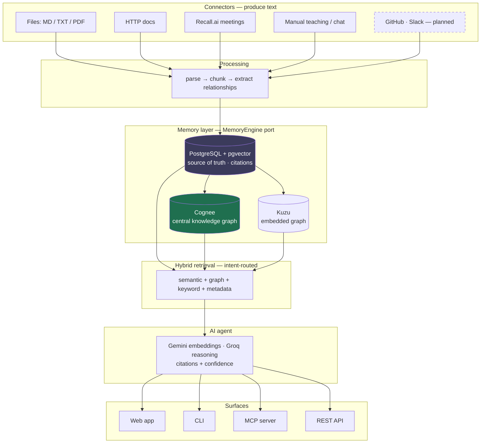

# OpsMemory

> **The Operational Memory Layer for Engineering Teams**

OpsMemory continuously ingests engineering knowledge (docs, runbooks, ADRs,
postmortems, documentation sites), extracts operational experiences, builds a
knowledge graph, and answers questions with evidence-backed AI reasoning.
Engineers can *teach* it lessons from real incidents — every lesson improves
future answers.

Unlike a document search engine or a plain RAG chatbot, OpsMemory stores
*understanding*: services, teams, incidents, architecture decisions, and —
most importantly — operational experiences that grow with every lesson your
organization learns.

## Features

- **OpsMemory incident hub + web app** — each incident is a continuously-growing
  knowledge object. A dark, Linear/Notion-style SPA (served at `/`) provides
  login, a memory dashboard, incident cards, and an incident workspace with
  three tabs: **Data Collection** (upload documents as real files — Markdown,
  `.txt`, PDF — or pasted text; add manual knowledge; connector tiles for
  GitHub/Slack/media upload marked *soon*), **Documentation** (living, cited,
  auto-generated — including a full **Detailed Summary** block), and
  **AI Chat** (scoped to that incident) — plus a global assistant and a
  **Visualize the Cognee Memory** view of the live knowledge graph. See
  [ADR-0008](docs/adr/0008-incident-hub-and-auth.md).
- **Meeting Intelligence** — invite a Recall.ai bot to an engineering meeting
  (Google Meet/Zoom/Teams); when it ends, the transcript is downloaded and AI
  extracts structured incident knowledge that **enriches an incident** — an
  existing one you pick, or a **new incident auto-created and AI-named** from
  the transcript. Meetings are evidence, never standalone: they update the
  incident's living documentation, operational experience, memory, graph, and
  timeline, with lifecycle notifications. Deleting a meeting cascades and
  regenerates the documentation. See [ADR-0008](docs/adr/0008-incident-hub-and-auth.md).
- **Connector framework** — local files, HTTP documentation crawling, and the **Recall.ai Meeting Connector** (Google Meet/Zoom/Teams);
  GitHub, Slack, Confluence plug in behind the same interface.
- **Knowledge processing pipeline** — deterministic parsing (Markdown, HTML,
  YAML, JSON), heading-aware semantic chunking, relationship extraction.
- **Hybrid retrieval** — pgvector semantic search + knowledge graph traversal
  (Kuzu) + keyword + metadata, selected per intent, cost-aware.
- **AI agent** — retrieval-oriented: the platform orchestrates, the LLM only
  reasons over curated evidence; every answer carries citations + confidence.
- **Continuous learning** — teach via CLI, API, chat, or dashboard; duplicate
  detection reinforces confidence instead of duplicating knowledge.
- **MCP server** — expose organizational memory as tools to Claude Code and
  other MCP clients (`opsmemory-mcp`).
- **Configurable AI providers** — Gemini and/or Groq (and Anthropic), selected
  independently for embeddings and reasoning; fully functional keyless
  fallbacks for development.

## Quickstart

Requirements: Python 3.13+, [uv](https://docs.astral.sh/uv/), Docker.

```bash
# 1. Install
make install
cp .env.example .env        # add OPSMEMORY_GEMINI_API_KEY / OPSMEMORY_GROQ_API_KEY

# 2. Start PostgreSQL (pgvector), migrate, run the API
make db-up && make migrate
make api                    # http://localhost:8000 (OpsMemory web app) · /docs (OpenAPI)
                            # sign in with admin@opsmemory.local / opsmemory

# 3. Ingest knowledge and ask questions
uv run opsmemory ingest ./samples/docs
uv run opsmemory ask "How do we recover redis?"
uv run opsmemory teach "The outage was caused by an expired secret; we rotated it."
uv run opsmemory search "payments-api"
uv run opsmemory graph payments-api --dependencies

# Or run the whole PRD demo flow:
./scripts/demo.sh
```

Docker Compose alternative: `docker compose up` (Postgres + migrations + API).

### Using the web app

Open `http://localhost:8000`, sign in (`admin@opsmemory.local` / `opsmemory`),
then work an incident end to end:

1. **New incident** — give it a title and severity. It becomes a knowledge hub.
2. **Data Collection** tab — **Upload Document** (drop a real `.md` / `.txt` /
   PDF file, or paste text), or **Add knowledge** to teach a lesson directly.
3. **Documentation** tab — auto-generated, cited living docs regenerate from the
   evidence (Overview, Root Cause, Resolution, and a full **Detailed Summary**).
   Hit **Regenerate** after adding more.
4. **AI Chat** tab — ask questions scoped to this incident; answers carry
   citations + confidence. The global **Assistant** also surfaces related
   incidents found through the graph.
5. **Meeting Intelligence** — invite the Recall.ai bot to a live meeting; when
   it ends, the transcript enriches an incident (existing or auto-created).
6. **Visualize the Cognee Memory** — render the live knowledge graph.

### Local Kubernetes (Kind) — one command

```bash
make lab        # Kind cluster + Postgres(pgvector) + OpsMemory (Helm, migrations
                # as a hook) + sample knowledge, served at http://localhost:8000
make lab-down   # tear it all down
```

Requires kind, kubectl, helm, docker. API keys from your `.env` are passed
into the cluster automatically; without keys the lab runs in keyless mode.

## AI provider configuration

Embeddings and reasoning are configured independently — use Gemini for both,
or Gemini embeddings with Groq reasoning, etc.

| Setting | Values | Default |
|---------|--------|---------|
| `OPSMEMORY_LLM_PROVIDER` | `auto`, `groq`, `gemini`, `anthropic`, `none` | `auto` |
| `OPSMEMORY_EMBEDDING_PROVIDER` | `auto`, `gemini`, `hashing` | `auto` |
| `OPSMEMORY_MEMORY_ENGINE` | `cognee` (central), `native` (raw pgvector) | `cognee` |

`auto` resolves from whichever API keys are set (LLM: groq → gemini →
anthropic → none). Groq offers no embeddings API, so embeddings come from
Gemini (or the keyless `hashing` fallback for development).
See [ADR-0006](docs/adr/0006-ai-provider-strategy.md).

**Memory engine.** [Cognee](https://github.com/topoteretes/cognee) is the
central, compulsory memory engine (a core dependency, the default): every
write is cognified into its knowledge graph, over the platform's own
PostgreSQL + pgvector (the durable, traceable substrate that backs API
citations, ADR-0003). Cognification needs a Gemini key; without one the engine
transparently uses the substrate and logs that graph-building is inactive.
`native` exposes the raw pgvector substrate and is used by the test suite.
See [ADR-0002](docs/adr/0002-cognee-behind-memory-engine-port.md).

## How We Used Cognee (Hackathon Submission)

We deeply integrated **Cognee** as the core intelligence layer for OpsMemory, elevating it from a standard RAG application into a true cognitive architecture for engineering teams.

1. **Continuous Knowledge Ingestion (Cognification)**:
   Whenever new engineering evidence is added—whether it's an incident document, a meeting transcript captured by our Recall.ai bot, or manual operational knowledge—OpsMemory automatically processes it in the background. We use Cognee to ingest this raw data, generate semantic embeddings, build graph relationships, and continuously update the organizational memory.

2. **Graph-Powered Engineering Memory**:
   Traditional RAG systems simply retrieve the most similar text chunk. By leveraging Cognee's graph capabilities, OpsMemory performs graph-aware retrieval. It maps the complex relationships between incidents, microservices, teams, and root causes. When an engineer asks, *"Have we experienced Redis authentication failures before?"*, Cognee traverses the graph to synthesize a comprehensive, evidence-backed answer rather than just returning isolated documents.

3. **Hybrid Retrieval (Vector + Graph)**:
   We combined pgvector (for semantic similarity) with Cognee's graph traversal. This ensures that the AI agent has the full context of how an incident impacts the broader architecture, allowing for highly accurate root-cause analysis and resolution recommendations based on historical data.

## Meeting Connector (Recall.ai)

OpsMemory includes a fully functional meeting connector powered by [Recall.ai](https://recall.ai). You can invite the OpsMemory bot to your engineering meetings (Google Meet, Zoom, Microsoft Teams) to automatically capture and learn from postmortems, incident responses, and architectural discussions.

1. **Invite the bot**: Send a `POST` to `/api/v1/meetings` with your meeting URL.
2. **Record**: The headless bot joins your meeting and captures the audio/video.
3. **Webhook**: When the meeting ends, Recall.ai sends a Svix-signed webhook to your OpsMemory server (`/api/v1/webhooks/recall`).
4. **AI Extraction**: The raw transcript is downloaded and sent to the configured LLM using a specialized SRE persona prompt.
5. **Knowledge Pipeline**: The AI extracts structured incident reports (severity, affected services, root cause, resolution, lessons learned). This data is automatically injected into the **Teaching Pipeline**, embedded into the **Semantic Memory**, and projected as new edges into the **Knowledge Graph**.

*Requires `OPSMEMORY_RECALL_API_KEY` in your `.env`.*

## MCP server

```bash
claude mcp add opsmemory -- uv run --directory /path/to/opsmemory opsmemory-mcp
```

Tools exposed: `ask`, `search`, `teach`, `list_services`, `graph_neighbors`,
`service_dependencies`, `platform_stats`. The server talks to the REST API at
`OPSMEMORY_API_URL` (default `http://localhost:8000`).

## CLI overview

`opsmemory` — `ingest` · `connectors list/add/remove/sync/status` · `search` ·
`ask` · `teach` · `graph` · `services` · `incidents` · `repositories` ·
`jobs` · `stats` · `health` · `config show/validate` · `shell` — all with
`--output table|json|yaml`.

## Architecture

Everything an engineer feeds in — files, docs, meeting transcripts, manual
lessons — converges on one `MemoryEngine` port. Cognee cognifies every write
into a knowledge graph, while PostgreSQL + pgvector remains the durable,
traceable substrate that backs API citations. Retrieval is hybrid and
intent-routed; the LLM only reasons over curated, cited evidence.



**The memory lifecycle (Cognee).** Every write funnels through four
operations, so adding a new connector is trivial — it only has to turn its
signal into text and call `remember()`:

| Verb | Role | In OpsMemory |
|------|------|--------------|
| `remember()` | ingest + structure into the graph (runs Extract→Cognify→Load) | every document, transcript, and lesson |
| `recall()` | query; auto-routes semantic vs. graph traversal | incident-scoped and global chat |
| `improve()` / memify | enrich + reweight on feedback | teaching pipeline reinforces confidence on repeat lessons |
| `forget()` | prune / delete | deletion cascade when a meeting or incident is removed |

See [docs/architecture.md](docs/architecture.md) and the ADRs in
[docs/adr/](docs/adr/) for the decisions behind Kuzu, Cognee, provider
strategy, and storage boundaries.

## Status

| Milestone | Scope | Status |
|-----------|-------|--------|
| M1 — Foundation | Project skeleton, config, database + migrations, API/CLI skeletons, Docker, Helm | ✅ |
| M2 — Ingestion | Connector framework, local files connector, processing pipeline | ✅ |
| M3 — Semantic retrieval | Embeddings, pgvector search, keyword/metadata retrieval | ✅ |
| M4 — Knowledge graph | Kuzu graph store, relationship extraction, graph APIs | ✅ |
| M5 — Memory engine | Native pgvector engine + optional Cognee adapter | ✅ |
| M6 — Hybrid retrieval | Intent routing, strategy selection, ranking, context assembly | ✅ |
| M7 — AI agent | Chat, citations, confidence, teaching intent | ✅ |
| M8 — Teaching pipeline | Duplicate detection, confidence evolution, memory updates | ✅ |
| M9 — Connectors & jobs | HTTP docs connector, Recall.ai Meeting Connector, async ingestion jobs | ✅ |
| M10 — Platform | Web dashboard, MCP server, Kind bootstrap, sample knowledge, demo flow | ✅ |

Deferred beyond MVP: GitHub and Slack connectors, enterprise auth/RBAC,
scheduled sync, media/video upload ingestion, simulated incident workloads in
the Kind lab. (Live Cognee graph visualization is available via the
**Visualize the Cognee Memory** view.)

## Development

```bash
make check          # ruff + mypy(strict) + pytest + helm lint
make docker-build   # container image
make lab            # local Kubernetes lab (kind + helm + samples)
```

See [docs/development.md](docs/development.md) for conventions, migrations,
and testing details.